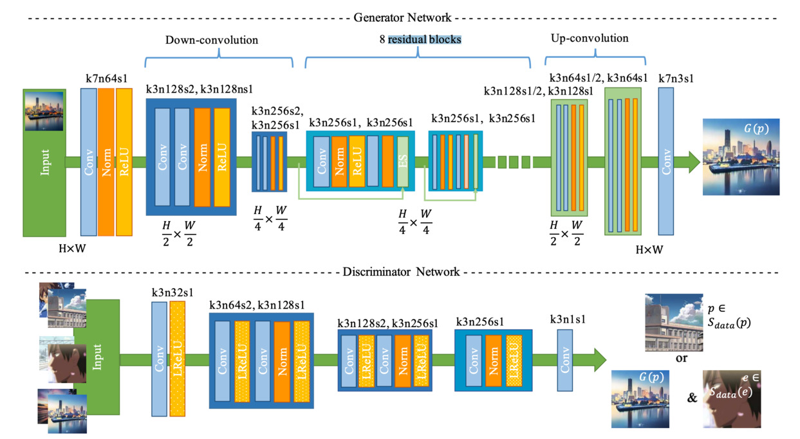
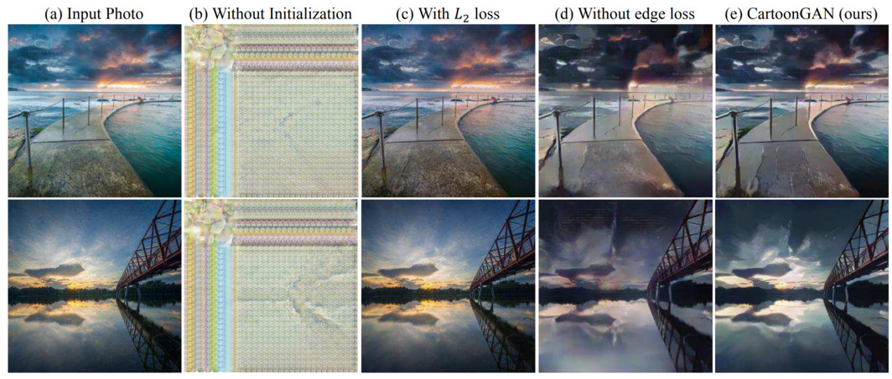
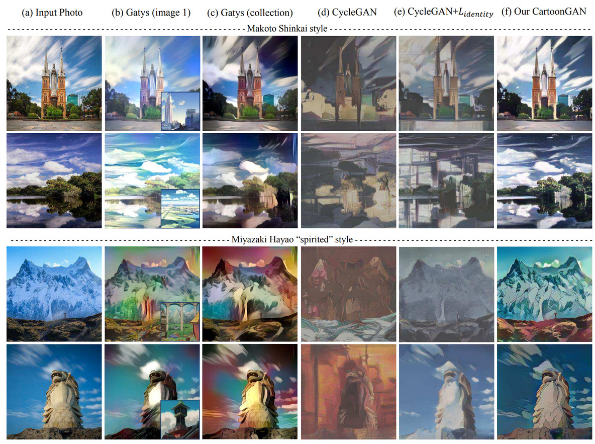

# Paper
[Link](https://openaccess.thecvf.com/content_cvpr_2018/papers/Chen_CartoonGAN_Generative_Adversarial_CVPR_2018_paper.pdf)

# Abstruct
既存手法（Style Transfer, CycleGAN)では、実写画像のアニメ調変換においては、十分な結果を得られていない。
VGGのFeature Mapを用いたContent Lossと、明確なエッジを生成するためのAdversarial Lossの２つの効果的な損失関数を提案。

# Architecture

## Loss function
$$
\mathcal{L}(G, D)=\mathcal{L}\_{a d v}(G, D)+\omega \mathcal{L}_{c o n}(G, D) \tag{2}
$$

StyleとContentのバランスが良い状態になるのは、$\omega=10$

### Adversarial loss
$$
\begin{aligned}
\mathcal{L}\_{a d v}(G, D) &=\mathbb{E}\_{c_{i} \sim S_{d a t a}(c)}\left[\log D\left(c_{i}\right)\right] \\\\
&+\mathbb{E}\_{e_{j} \sim S_{d a t a}(e)}\left[\log \left(1-D\left(e_{j}\right)\right)\right] \\\\
&+\mathbb{E}\_{p_{k} \sim S_{d a t a}(p)}\left[\log \left(1-D\left(G\left(p_{k}\right)\right)\right)\right] \\\\
\end{aligned}
\tag{3}
$$

生成される画像のエッジを明確なものにするために、
- 通常の訓練画像 → true
- エッジをぼかした訓練画像 → false
- 生成画像 → false

でDiscriminatorを学習させる

### Content loss

$$
\begin{array}{l}
\mathcal{L}\_{\text {con}}(G, D)=\mathbb{E}\_{p_{i} \sim S_{\text {data}}(p)}\left[\left\|V G G_{l}\left(G\left(p_{i}\right)\right)-V G G_{l}\left(p_{i}\right)\right\|_{1}\right]
\end{array}
\tag{4}
$$

VGGのFeature Map(Conv4_4)の差のL1スパース正則化で定式化。

多くの先行研究では、Content lossは、L2やMSEを用いることが多いが、L1を使うことで良い結果が得られた。

# Result

Gatysらの結果のほうがよく見えるが、Style Transferは、1対1の変換しかできず、抽象的に画風を学習できない。
それに加えて、同じような場面のスタイル画像をユーザが選ばなければならない。
